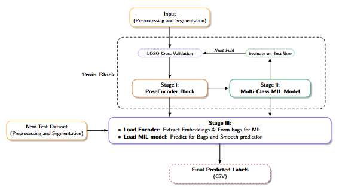
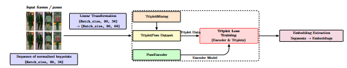
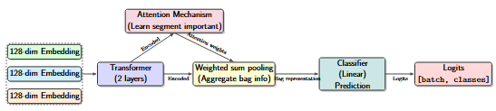
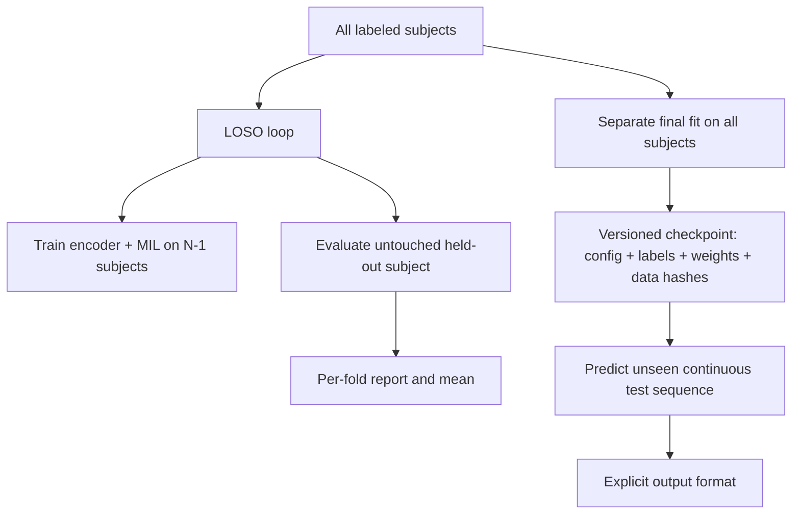

# Architecture and data flow

This page describes the maintained implementation, not an assertion that the paper's historical numbers can be recreated without its original data and exact run settings. Start with the [README](../README.md), use [data contract](data.md) to prepare CSVs, and use [operations](operations.md) for repeatable runs.

## Three stages

1. **Pose preparation.** Validate numeric 2D joint coordinates; center all joints at the midpoint of the hips; scale by shoulder distance. Form overlapping windows. Normalization is per frame, so it has no fitted statistics from another subject.
2. **Triplet encoder.** Sample an anchor and positive from the same class and a negative from another class. Train a Transformer with margin-1 triplet loss. Mean pooling gives a 128-dimensional representation per window.
3. **Temporal MIL classifier.** Group three neighboring embeddings from the same continuous subject sequence. A Transformer and learned attention pooling produce eight-class logits. The training target is the middle window's majority label.

These diagrams were supplied with the project and originate from the associated paper, [Pham et al. (2026), DOI 10.1088/1742-6596/3180/1/012001](https://doi.org/10.1088/1742-6596/3180/1/012001), licensed CC BY 4.0. They explain the conceptual pipeline; the executable source of truth is [`src/isas_pose/`](../src/isas_pose/). The overview abbreviates the final training stage: a deployed checkpoint is fitted afresh on all labeled subjects after evaluation.

## Shape and ownership contracts

| Boundary | Shape / content | Owner |
| --- | --- | --- |
| Input CSV | One row per frame; `frame_id`, 17 pairs of `*_x`, `*_y`, training `Action Label` | [`data.py`](../src/isas_pose/data.py) |
| Normalized pose | `[frames, 17, 2]`, float32 | `normalize_pose` |
| Window | `[windows, W, 17, 2]`; default `W=90`, stride `15` | `make_windows` |
| Encoder input | `[batch, W, 34]` | [`pipeline.py`](../src/isas_pose/pipeline.py) |
| Embedding | `[windows, 128]` | [`models.py`](../src/isas_pose/models.py) |
| MIL bag | `[bags, B, 128]`; default `B=3` | `make_bags` |
| Classifier output | `[batch, number_of_training_labels]` logits | `MILTransformer` |
| Prediction output | Filled test CSV or three-column submission CSV | [`export.py`](../src/isas_pose/export.py) |

The loader rejects missing or nonfinite joint coordinates. Training windows containing `None` or missing labels are removed without joining sequences across the excluded span. Windows cannot cross frame-ID gaps; bags cannot cross window gaps. Test inference requires a continuous input file because forward/backward fill across separate sessions would give misleading labels.

## Evaluation versus deployment

The held-out subject's labels are used only for scoring its fold. Final fitting may use all **available labeled** subjects, but is never itself reported as a LOSO score. See [reproducibility notes](reproducibility.md) for changes from the original notebook.
