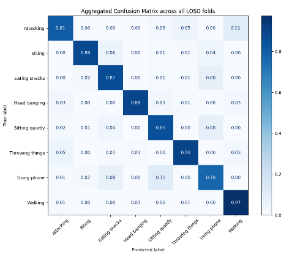

# Historical results and reproducibility boundary

The tables and figure below transcribe the **supplied paper images**. They are historical research results, not output from the current refactored code. Source: [Pham et al., *Journal of Physics: Conference Series* 3180 (2026) 012001](https://doi.org/10.1088/1742-6596/3180/1/012001), CC BY 4.0. A future rerun should store its own JSON under `artifacts/` and state the dataset checksum, subject IDs, parameters, seed, device and package versions.

## Reported LOSO summary

| Held-out subject | F1 | Accuracy |
| --- | ---: | ---: |
| 1 | 0.89 | 0.86 |
| 2 | 0.89 | 0.88 |
| 3 | 0.85 | 0.85 |
| 4 | 0.85 | 0.86 |
| 5 | 0.89 | 0.90 |
| **Mean** | **0.87** | **0.87** |

The matrix is normalized by true class in the supplied figure. It is a paper figure; `evaluate` currently emits a binary confusion matrix for each fold and an eight-class classification report. A new confusion-matrix image must be generated from a new run, never reused as evidence for that run.

## Reported test-file class metrics

| Activity | Precision | Recall | F1 |
| --- | ---: | ---: | ---: |
| Attacking | 0.86 | 0.90 | 0.88 |
| Biting nails | 0.87 | 0.92 | 0.90 |
| Eating snacks | 0.82 | 0.76 | 0.79 |
| Head banging | 0.97 | 0.87 | 0.91 |
| Sitting quietly | 0.90 | 0.82 | 0.86 |
| Throwing things | 0.74 | 0.85 | 0.80 |
| Using phone | 0.75 | 0.82 | 0.78 |
| Walking | 0.94 | 0.99 | 0.96 |
| **Accuracy** |  |  | **0.85** |
| **Macro average** | **0.86** | **0.86** | **0.86** |

These test-file figures and the five-subject LOSO summary are different evaluations. Do not merge them into one headline score.

## Reported window/stride study

| Window | Stride | Accuracy LOSO / subject 4 (%) | F1 LOSO / subject 4 (%) |
| ---: | ---: | ---: | ---: |
| 30 | 15 | 82 / 79 | 81 / 80 |
| 60 | 30 | 84 / 80 | 83 / 80 |
| 90 | 45 | 85 / 85 | 85 / 86 |
| 120 | 60 | 87 / 86 | 87 / 86 |
| 150 | 75 | 85 / 86 | 85 / 86 |

The notebook uses **90/15**; the supplied paper table compares different pairs, including **90/45** and **120/60**. The CLI defaults preserve the notebook's 90/15 rather than claiming that the historical best table row was rerun. Set `--window-size` and `--stride` explicitly for a controlled comparison, and save each run to a different output path.

## Comparison reported in the paper

| Method | F1 | Accuracy |
| --- | ---: | ---: |
| ST-GCN | 55% | 63% |
| DeepConvLSTM | 50% | 60% |
| PoseFormer | 32% | 47% |
| LSTM + raw keypoint | 57% | 56% |
| LSTM + feature engineering | 67% | 65% |
| ST-LSTM + trust gates | 20% | 35% |
| Triplet-MIL + LSTM | 84% | 86% |
| Triplet-MIL + Transformer | **87%** | **87%** |

This comparison is transcribed for context. The repository does not implement those baseline models and therefore cannot independently verify this table. Follow [operations](operations.md) and [reproducibility notes](reproducibility.md) for a new experiment.
